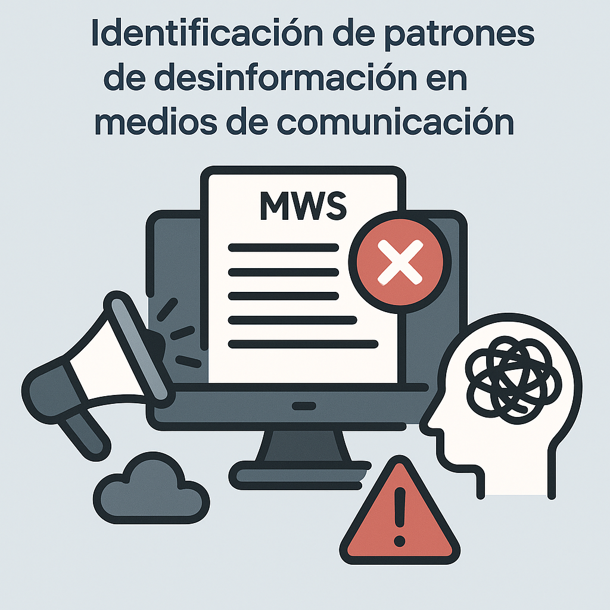

# Guion de Pitch – Intel Global Impact Festival 2025  

  

**Proyecto: Identificación de patrones de desinformación en medios de comunicación**  
**Duración: 2 minutos**  
**Participantes: Luisa Fernanda y Octavio**

---

## 0:00–0:20 — Introducción

**Octavio:**  
¡Hola, soy Octavio!

**Luisa Fernanda:**  
¡Y yo soy Luisa Fernanda! Y ambos somos estudiantes de Ingeniería en Ciencia de Datos en la Universidad Iberoamericana de Ciudad de México.

**Octavio:**  
Participamos en el desarrollo del proyecto de investigación: **"Identificación de patrones de desinformación en medios de comunicación".**  Este proyecto fue desarrollado utilizando tecnologías de Intel® durante su etapa de diseño y prueba de concepto.

---

## 0:20–0:45 — El problema

**Luisa Fernanda:**  
Hoy en día, las redes sociales son el principal medio por el cual muchas personas se informan... pero también son la vía más rápida para difundir desinformación.

**Octavio:**  
Las noticias falsas generan confusión, polarización social y decisiones mal informadas. Es un problema global que afecta la democracia y la cohesión social.

**Luisa Fernanda:**  
Si se considera la política seguida por X (anteriormente Twitter), donde la moderación de contenidos dejó de ser prioridad, la detección de patrones de desinformación cobra aún más relevancia.

---

## 0:45–1:10 — La solución

**Octavio:**  
Nuestra propuesta utiliza inteligencia artificial para detectar e identificar patrones lingüísticos, psicológicos y visuales en contenido engañoso.

**Luisa Fernanda:**  
Integramos múltiples enfoques: procesamiento de lenguaje natural, verificación automática con grafos de conocimiento, y análisis multimodal que combina texto e imagen.

---

## 1:10–1:30 — Tecnología y ética

**Luisa Fernanda:**  
Usamos machine learning, deep learning y modelos explicables para que el sistema no solo funcione, sino que las personas puedan entender cómo y por qué clasifica algo como desinformación. Cuando las personas entienden el por qué de las decisiones automatizadas, son más propensas a tomar decisiones correctas.

**Octavio:**  
Durante el desarrollo, empleamos procesadores Intel® Core™ para entrenamiento y pruebas del sistema, así como el entorno **Intel® DevCloud**, que nos permitió evaluar desempeño y escalar pruebas de modelos. Además, integramos herramientas del ecosistema **Intel® oneAPI** para optimizar el procesamiento de cargas de IA. Diseñamos todo el sistema bajo principios de IA responsable: privacidad, equidad, inclusión, transparencia y seguridad.

---

## 1:30–1:50 — Impacto

**Octavio:**  
Este proyecto es útil para periodistas, educadores, medios de comunicación y plataformas sociales que quieren combatir la desinformación. Sobre todo, es especialmente útil para las personas, ya que les permite discernir entre información verídica y desinformación.

**Luisa Fernanda:**  
Queremos empoderar a las personas con herramientas que promuevan el pensamiento crítico y la confianza en la información verificada.

---

## 1:50–2:00 — Cierre

**Luisa Fernanda:**  
Una sociedad informada es una sociedad más libre.

**Octavio:**  
¡La verdad nos hará libres!

---

# Pitch Script – Intel Global Impact Festival 2025  

## 0:00–0:20 — Introduction

**Octavio:**  
Hi, I'm Octavio!

**Luisa Fernanda:**  
And I'm Luisa Fernanda! We are both students of the Data Science Engineering program at Universidad Iberoamericana in Mexico City.

**Octavio:**  
We participated in the development of the research project: **"Identification of Misinformation Patterns in Media."** This project was developed using Intel® technologies during its design and proof-of-concept stages.

---

## 0:20–0:45 — The Problem

**Luisa Fernanda:**  
Today, social media is the main source of information for many people... but it’s also the fastest channel to spread disinformation.

**Octavio:**  
Fake news creates confusion, social polarization, and misinformed decisions. It’s a global issue that threatens democracy and social cohesion.

**Luisa Fernanda:**  
Considering the policies adopted by X (formerly Twitter), where content moderation is no longer a priority, detecting patterns of disinformation becomes even more crucial.

---

## 0:45–1:10 — The Solution

**Octavio:**  
Our proposal uses artificial intelligence to detect and identify linguistic, psychological, and visual patterns in misleading content.

**Luisa Fernanda:**  
We integrate multiple approaches: natural language processing, automated fact-checking using knowledge graphs, and multimodal analysis combining text and image.

---

## 1:10–1:30 — Technology and Ethics

**Luisa Fernanda:**  
We use machine learning, deep learning, and explainable models so the system not only works, but people can also understand how and why it classifies content as misinformation. When people understand the reasons behind automated decisions, they are more likely to make better choices.

**Octavio:**  
During development, we used Intel® Core™ processors for training and testing, as well as the **Intel® DevCloud** environment, which allowed us to evaluate performance and scale model testing. We also integrated tools from the **Intel® oneAPI** ecosystem to optimize AI workload processing. The entire system was designed following responsible AI principles: privacy, fairness, inclusion, transparency, and security.

---

## 1:30–1:50 — Impact

**Octavio:**  
This project is useful for journalists, educators, media outlets, and social platforms seeking to fight disinformation. Most importantly, it empowers individuals to discern between verified information and disinformation.

**Luisa Fernanda:**  
We aim to empower people with tools that promote critical thinking and trust in verified content.

---

## 1:50–2:00 — Closing

**Luisa Fernanda:**  
An informed society is a freer society.

**Octavio:**  
The truth will set us free!